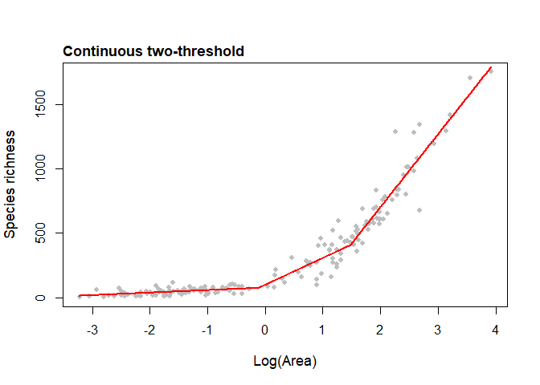

<!-- README.md is generated from README.Rmd. Please edit that file -->

# The **‘sars’** R Package 

[](https://app.circleci.com/pipelines/github/txm676/sars?branch=master)
[](https://cran.r-project.org/package=sars)
[](https://cran.r-project.org/package=sars)
[](https://cran.r-project.org/package=sars)
[](https://zenodo.org/badge/latestdoi/95295704)
[](https://www.gnu.org/licenses/gpl-3.0)
[](https://app.codecov.io/gh/txm676/sars?branch=master)

> *fit and compare **Species-Area Relationship (SAR)** models using
> multi-model inference*

**sars** provides functionality to fit twenty SAR model using non-linear
regression, and to calculate multi-model averaged curves using various
information criteria. The software also provides easy to use
functionality to plot multi-model SAR curves and to generate confidence
intervals using bootstrapping. Additional SAR related functions include
fitting the linear version of the power model and comparing parameters
with the non-linear version, fitting the general dynamic model of island
biogeography, fitting the random placement model to a species
abundance-site matrix, and extrapolating fitted SAR models to predict
richness on larger islands / sample areas. Version 1.3.0 has added
functions for fitting, evaluating and plotting a range of commonly used
piecewise SAR models (see Matthews and Rigal (2021) for details on these
functions). Version 2.0.0 has added functions to fit a range of habitat
and countryside SAR models, along with associated plot and prediction
functions.

Please report any bugs or issues to us via GitHub.

The package has an associated vignette that provides examples of how to
use the package, and an accompanying paper (Matthews et al. 2019).

A website for the package can be found here:
<https://txm676.github.io/sars/>

Version 1.1.1 of the package has been archived on the Zenodo research
data repository (DOI: 10.5281/zenodo.2573067).

## Table of Contents

- [Installation](#installation)
- [Example](#example-usage)
- [References](#references)

## Installation

You can install the released version of sars from
[CRAN](https://CRAN.R-project.org) with:

``` r
install.packages("sars")
```

And the development version from [GitHub](https://github.com/) with:

``` r
# install.packages("devtools")
devtools::install_github("txm676/sars")
```

## Example usage

Basic usage of **sars** will result in using two types of functions:

To fit the power sar model (Arrhenius 1921) to the ‘galapagos’ (Preston
1962) data set:

``` r
fit_pow <- sar_power(data = galap)
fit_pow
#> 
#> Model:
#> Power
#> 
#> Call:
#> S == c * A^z
#> 
#> Coefficients:
#>          c          z 
#> 33.1791553  0.2831868
```

Attempting to fit all 20 sar models to the ‘galapagos’ (Preston 1962)
data set and get a multi-model SAR:

``` r
mm_galap <- sar_average(data = galap)
#> 
#> Models to be fitted using a grid start approach: 
#> 
#>  Now attempting to fit the 20 SAR models: 
#> 
#> ──  multi_sars ────────────────────────────────────────────── multi-model SAR ──
#> → power    : ✔
#> → powerR   : ✔
#> → epm1     : ✔
#> → epm2     : ✔
#> → p1       : ✔
#> → p2       : ✔
#> → loga     : ✔
#> → koba     : ✔
#> → monod    : ✔
#> → negexpo  : ✔
#> → chapman  : ✔
#> → weibull3 : ✔
#> → asymp    : ✔
#> → ratio    : ✔
#> → gompertz : ✔
#> → weibull4 : ✔
#> → betap    : ✔
#> → logistic : ✔
#> → heleg    : ✔
#> → linear   : ✔
#> 
#> No model validation checks selected
#> 
#> 20 remaining models used to construct the multi SAR:
#>  Power, PowerR, Extended Power model 1, Extended Power model 2, Persistence function 1, Persistence function 2, Logarithmic, Kobayashi, Monod, Negative exponential, Chapman Richards, Cumulative Weibull 3 par., Asymptotic regression, Rational function, Gompertz, Cumulative Weibull 4 par., Beta-P cumulative, Logistic(Standard), Heleg(Logistic), Linear model 
#> ────────────────────────────────────────────────────────────────────────────────
```

Each of the ‘fitted’ objects have corresponding plot methods:

To fit the logarithmic SAR model (Gleason 1922) to the ‘galapagos’ data
set and plot it

``` r
fit_loga <- sar_loga(data = galap)

plot(fit_loga)
```


To fit a multimodel SAR curve to the ‘galapagos’ data set and plot it
(alongside the individual model fits)

``` r
mm_galap <- suppressMessages(sar_average(data = galap, verb = FALSE))
#> 
#> Models to be fitted using a grid start approach: 
#> 
#>  Now attempting to fit the 20 SAR models: 
#> 
#> ──  multi_sars ────────────────────────────────────────────── multi-model SAR ──
#> → power    : ✔
#> → powerR   : ✔
#> → epm1     : ✔
#> → epm2     : ✔
#> → p1       : ✔
#> → p2       : ✔
#> → loga     : ✔
#> → koba     : ✔
#> → monod    : ✔
#> → negexpo  : ✔
#> → chapman  : ✔
#> → weibull3 : ✔
#> → asymp    : ✔
#> → ratio    : ✔
#> → gompertz : ✔
#> → weibull4 : ✔
#> → betap    : ✔
#> → logistic : ✔
#> → heleg    : ✔
#> → linear   : ✔
#> 
#> No model validation checks selected
#> 
#> 20 remaining models used to construct the multi SAR:
#>  Power, PowerR, Extended Power model 1, Extended Power model 2, Persistence function 1, Persistence function 2, Logarithmic, Kobayashi, Monod, Negative exponential, Chapman Richards, Cumulative Weibull 3 par., Asymptotic regression, Rational function, Gompertz, Cumulative Weibull 4 par., Beta-P cumulative, Logistic(Standard), Heleg(Logistic), Linear model 
#> ────────────────────────────────────────────────────────────────────────────────
mm_galap 
#> 
#> This is a sar_average fit object:
#> 
#> 20 models successfully fitted
#> 
#> AICc used to rank models


plot(mm_galap, pLeg = FALSE, mmSep = TRUE)
```


To fit the two-threshold continuous model to the ‘aegean2’ dataset

``` r
fit <- sar_threshold(data = aegean2, mod = c("ContTwo"), interval = 0.1, 
                     non_th_models = FALSE, logAxes = "area", con = 1,
                     logT = log10, nisl = NULL)
plot(fit, cex = 0.8, cex.main = 1.1, cex.lab = 1.1, pcol = "grey") #Figure 1
```



## References

<div id="refs" class="references csl-bib-body hanging-indent"
entry-spacing="0">

<div id="ref-Arrhenius1921" class="csl-entry">

Arrhenius, O. 1921. “<span class="nocase">Species and Area</span>.” *The
Journal of Ecology* 9 (1): 95. <https://doi.org/10.2307/2255763>.

</div>

<div id="ref-Gleason1922" class="csl-entry">

Gleason, H. A. 1922. “<span class="nocase">On the Relation Between
Species and Area</span>.” *Ecology* 3 (2): 158–62.
<https://doi.org/10.2307/1929150>.

</div>

<div id="ref-Matthews2020" class="csl-entry">

Matthews, T. J., and F. Rigal. 2021. “<span class="nocase">Thresholds
and the species–area relationship: a set of functions for fitting,
evaluating and plotting a range of commonly used piecewise models in
R</span>.” *Frontiers of Biogeography* 13: e49404.

</div>

<div id="ref-Matthews2019" class="csl-entry">

Matthews, T. J., K. A. Triantis, R. J. Whittaker, and F. Guilhaumon.
2019. “<span class="nocase">sars: an R package for fitting, evaluating
and comparing species–area relationship models</span>.” *Ecography* 42:
1446–55. <https://doi.org/10.1111/ecog.04271>.

</div>

<div id="ref-Preston1962" class="csl-entry">

Preston, F. W. 1962. “<span class="nocase">The Canonical Distribution of
Commonness and Rarity: Part I</span>.” *Ecology* 43 (2): 185.
<https://doi.org/10.2307/1931976>.

</div>

</div>
