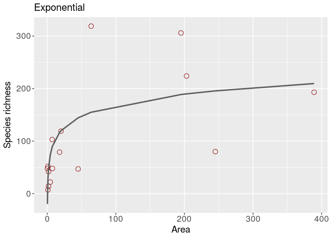

<!-- README.md is generated from README.Rmd. Please edit that file -->
sars
====

The goal of sars is to fit and compare species-area relationship models using multimodel inference.

Installation
------------

You can install the released version of sars from [CRAN](https://CRAN.R-project.org) with:

``` r
install.packages("sars")
```

And the development version from [GitHub](https://github.com/) with:

``` r
# install.packages("devtools")
devtools::install_github("txm676/sars")
```

Example
-------

Basic usage of sars will result in using to types of functions:

``` r
library(sars)

#fitting the power sar model (Arrhenius, 1921) to the 'galapagos' data set
fit_pow <- sar_power(data = galap)

#attempting to fit all 20 sar models to the 'galapagos' data set and generate a multimodel inference
mm_galap <- multi_sars(data = galap)
#> -- fitting model:  sar_power 
#> -- fitting model:  sar_powerR 
#> -- fitting model:  sar_epm1 
#> -- fitting model:  sar_epm2 
#> -- fitting model:  sar_p1 
#> -- fitting model:  sar_p2 
#> -- fitting model:  sar_expo 
#> -- fitting model:  sar_koba 
#> -- fitting model:  sar_mmf 
#> -- fitting model:  sar_monod 
#> -- fitting model:  sar_negexpo 
#> -- fitting model:  sar_chapman
#> Warning: Chapman Richards: singular gradient matrix at parameter estimates.
#> Could not compute parameters significance and conf intervals.
#> -- fitting model:  sar_weibull3
#> Warning: Cumulative Weibull 3 par.: singular gradient matrix at parameter
#> estimates. Could not compute parameters significance and conf intervals.
#> -- fitting model:  sar_asymp 
#> -- fitting model:  sar_ratio 
#> -- fitting model:  sar_gompertz
#> Warning: Gompertz: singular gradient matrix at parameter estimates. Could
#> not compute parameters significance and conf intervals.
#> -- fitting model:  sar_weibull4 
#> -- fitting model:  sar_betap
#> Warning: Beta-P cumulative: singular gradient matrix at parameter
#> estimates. Could not compute parameters significance and conf intervals.
#> -- fitting model:  sar_heleg
```

Most of 'fitting' functions have corresponding plot methods

``` r
#fitting the exponential sar model (Gleason, 1922) to the 'galapagos' data set
fit_expo <- sar_expo(data = galap)

#plot it
plot(fit_expo)
```



Troubleshoutting
----------------

If, despite the :heart: brought during the programming of this R package and writing of this documentation, you have difficulties to install or run sars, if you have questions about the procedures or calculations, or if you want to report bugs :beetle:, do not hesitate to consult the official sars documentation above or on [CRAN](https://CRAN.R-project.org/package=sars) or connect with us on [GitHub](https://github.com/txm676/sars).
