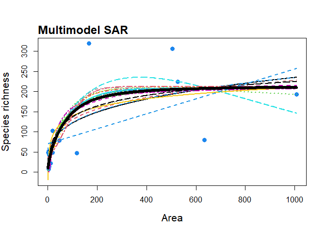

<!-- README.md is generated from README.Rmd. Please edit that file -->
The **'sars'** R Package 
=========================================================================================

[](https://travis-ci.org/txm676/sars) [](https://cran.r-project.org/package=sars) [](https://cran.r-project.org/package=sars) [](https://codecov.io/github/txm676/sars?branch=master)

> *fit and compare **Species-Area Relationship (SAR)** models using multi-model inference*

**sars** provides functionality to fit twenty SAR model using non-linear regression, and to calculate multi-model averaged curves using various information criteria. The software also provides easy to use functionality to plot multi-model SAR curves and to generate confidence intervals using bootstrapping. Additional SAR related functions include fitting the linear version of the power model and comparing parameters with the non-linear version, fitting the general dynamic model of island biogeography, and fitting the random placement model to a species abundance - site matrix.

As this is version 1.1.0 of the package, it is possible that there are some bugs in places. Please report any issues to us via GitHub.

A website for the package can be found here: <https://txm676.github.io/sars/>

Table of Contents
-----------------

-   [Installation](#installation)
-   [Example](#example-usage)
-   [Troubleshoutting](#troubleshoutting)
-   [References](#references)

Installation
------------

You can install the released version of sars from [CRAN](https://CRAN.R-project.org) with:

``` r
install.packages("sars")
```

And the development version from [GitHub](https://github.com/) with:

``` r
# install.packages("devtools")
devtools::install_github("txm676/sars")
```

Example usage
-------------

Basic usage of **sars** will result in using two types of functions:

To fit the power sar model (Arrhenius 1921) to the 'galapagos' (Preston 1962) data set:

``` r
fit_pow <- sar_power(data = galap)
```

Attempting to fit all 20 sar models to the 'galapagos' (Preston 1962) data set and get a multi-model SAR:

``` r
mm_galap <- sar_average(data = galap)
#> 
#>  Now attempting to fit the 20 SAR models: 
#> 
#> ──  multi_sars ───────────────────────────────────────────────────────────────────────────── multi-model SAR ──
#> → power    : ✔
#> → powerR   : ✔
#> → epm1     : ✔
#> → epm2     : ✔
#> → p1       : ✔
#> → p2       : ✔
#> → loga     : ✔
#> → koba     : ✔
#> → mmf      : ✔
#> → monod    : ✔
#> → negexpo  : ✔
#> → chapman  : Warning: could not compute parameters statistics
#> → weibull3 : ✔
#> → asymp    : ✔
#> → ratio    : ✔
#> → gompertz : ✔
#> → weibull4 : ✔
#> → betap    : ✔
#> → heleg    : ✔
#> → linear   : ✔
#> 
#> Model fitting completed - all models succesfully fitted.  Now undertaking model validation checks.
#> Additional models  will be excluded if necessary:
#> 
#> 4 models failed the residuals normality test and  have been excluded  from the multi SAR:
#> Extended Power model 1, Asymptotic regression, Cumulative Weibull 4 par., Linear model
#> 16 remaining models used to construct the multi  SAR:
#>  Power, PowerR, Extended Power model 2, Persistence function 1, Persistence function 2, Logarithmic, Kobayashi, MMF, Monod, Negative exponential, Chapman Richards, Cumulative Weibull 3 par., Rational function, Gompertz, Beta-P cumulative, Heleg(Logistic) 
#> ───────────────────────────────────────────────────────────────────────────────────────────────────────────────
```

Each of the 'fitted' objects have corresponding plot methods:

to fit the logarithmic SAR model (Gleason 1922) to the 'galapagos' data set and plot it

``` r
fit_loga <- sar_loga(data = galap)

plot(fit_loga)
```


to fit a multimodel SAR curve to the 'galapagos' data set and plot it

``` r
mm_galap <- suppressMessages(sar_average(data = galap, verb = FALSE))

plot(mm_galap, pLeg = FALSE)
```



Troubleshoutting
----------------

If, despite the :heart: brought during the programming of this R :package: and writing of this documentation, you have difficulties to install or run sars, if you have questions about the procedures or calculations, or if you want to report bugs :beetle:, do not hesitate to connect with us on [GitHub](https://github.com/txm676/sars).

References
----------

Arrhenius, Olof. 1921. “Species and Area.” *The Journal of Ecology* 9 (1). British Ecological Society: 95. doi:[10.2307/2255763](https://doi.org/10.2307/2255763).

Gleason, Henry Allan. 1922. “On the Relation Between Species and Area.” *Ecology* 3 (2). Ecological Society of America: 158–62. doi:[10.2307/1929150](https://doi.org/10.2307/1929150).

Preston, F. W. 1962. “The Canonical Distribution of Commonness and Rarity: Part I.” *Ecology* 43 (2). Ecological Society of America: 185. doi:[10.2307/1931976](https://doi.org/10.2307/1931976).
